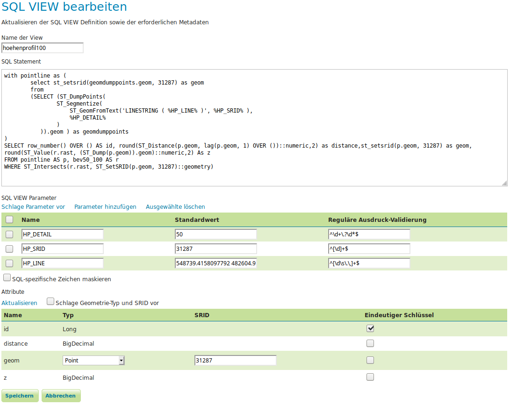

# Height profile as a Service

I could not find a best-practice example to implement a height profile service, so I did one myself.
In this example, a height profile service is provided by the means of a OGC WFS service, using only a default PostGIS and GeoServer installation.

## Data used

In this example I will be using the freely available height map with a cell size of 50 meters from the Austrian Federal Office of Metrology and Surveying (Bundesamt für Eich- und Vermessungswesen, BEV).

This file is provided in the Austrian Lambert projection system with the EPSG code 31287 . This is the reason this example will use this EPSG.

## Step 0: Software

  * a working PostgreSQL database with a PostGIS extension supporting rasters
  * a default GeoServer installation

## Step 1: Prepare the data

Any valid GDAL raster data source is supported if it can be converted to a TIFF file by gdal_translate.

In this example, the data provided by BEV is a set of single ArcGIS *.asc rasters. Luckily we can merge them together with gdal_merge.

```
gdal_merge.py -o merged_low.tif *.asc
```

Depending on the desired resolution and whether an interpolation should take place or not, the original TIFF containing the height map needs to be up/downscaled.

```bash
gdal_translate -outsize 500% 0 -r bilinear -a_srs EPSG:31287 -co COMPRESS=LZW -co NUM_THREADS=ALL_CPUS -co BIGTIFF=YES merged_low.tif merged.tif
```

The upscaling using bilinear filtering is relevant if you are planning to query points in a higher density than the raster resolution is. If you do not interpolate the raster beforehand, points of the linestring forming the route for the height profile being near each other will sometimes probe the same raster cell for height information which does not look nice.
We use LZW compression here since the the upscaled TIFF file will need a lot of space (around 4 GB with compression) and LZW is a bit faster then Deflate compression.
We also set the coordinat system with the parameter `-a_srs EPSG:31287`.

## Step 2: Import TIFF raster into PostGIS

When the height map file has been prepared as a TIFF, it can be converted into SQL INSERT statements with a command line tool provided by PostGIS itself:

```bash
raster2pgsql -t 100x100 -s 31287 -I merged.tif public.bev50 > bev50.sql
```

This will create the file `bev50.sql` containing raster data from `merged.tif` within the table `public.bev50` in SQL syntax. Be cautios, if you resampled the TIFF file in the previous step, you will produce a SQL file with about 20 GB in size.
The flag `-I` ensures that a spatial index is created. The parameter `-t 100x100` ensures that raster data is stored in 100x100 pixel tiles. These two parameters are important, otherwise, the height profile generation will be very slow. A value of 100x100 pixel has been deemed an optimum between processing time, size and speed. (the values 10x10, 100x100 and 1000x1000 were tested)
The parameter `-s 31287` ensures that the correct EPSG is used.

The generated SQL file can now be loaded into the PostGIS database. This may take a while.

```bash
sudo -u postgres psql -f /tmp/bev50.sql
```

The resulting PostGIS table will occupy about 3.8GB of disk space. Please bare in mind, that this is value is for 500% of the original size because of the bilinear resizing perfomed earlier. If a lower quality suffices for you or you do not need interpolated values, the size will be dramatically lower.

## Step 3: Set up the Height Profile WFS in GeoServer

You may wonder how we can create a height profile service with this data alone.

The solution is called a SQL view layer (https://docs.geoserver.org/stable/en/user/data/database/sqlview.html) .

GeoServer allows for specifying SQL statements containing placeholders that are filled with parameters contained within a WFS request.
This SQL statements are executed within a previously specified database.

The final configuration:



### Step 3.1: The SQL Code

The SQL code calculating a set of height values (and some other parameters that might be needed, like the distance from one point to the previous one) of a given input linestring looks like this:

```SQL
with pointline as (
	select st_setsrid(geomdumppoints.geom, 31287) as geom
	from
	(SELECT (ST_DumpPoints(
	        ST_Segmentize(
	            ST_GeomFromText('LINESTRING ( %HP_LINE% )', %HP_SRID% ),
	            %HP_DETAIL%
	        )
	   )).geom ) as geomdumppoints
)
SELECT row_number() OVER () AS id, round(ST_Distance(p.geom, lag(p.geom, 1) OVER ())::numeric,2) as distance,st_setsrid(p.geom, 31287) as geom, round(ST_Value(r.rast, (ST_Dump(p.geom)).geom)::numeric,2) As z
FROM pointline AS p, bev50 AS r
WHERE ST_Intersects(r.rast, ST_SetSRID(p.geom, 31287)::geometry);
```

Here, the parameters to be replaced are:

  * **HP_LINE**: this is a list of coordinate pairs, describing the line to be queried for its height for
  * **HP_SRID**: the EPSG code of the projection system the coordinates of the line in *HP_LINE* are provided in
  * **HP_DETAIL**: the distance between measurement points along the privided line in the unit of the coordinate system used (in this case it is in meters)

The SQL query pre-filled with a working set of parameters would look like this:

```SQL
with pointline as (
	select st_setsrid(geomdumppoints.geom, 31287) as geom
	from
	(SELECT (ST_DumpPoints(
	        ST_Segmentize(
	            ST_GeomFromText('LINESTRING (548739.4158097792 482604.95651756704, 548887.1511324001 482564.2491758545, 548918.931103315 482692.24078587623, 549028.5070438745 482647.3753966963, 549040.1888613633 482689.00756518065, 549104.3323370679 482674.76536810625, 549349.1178396618 482827.3313487823, 549781.0141441664 482895.7332890254)',31287),
	            50
	        )
	   )).geom ) as geomdumppoints
)
SELECT row_number() OVER () AS id, round(ST_Distance(p.geom, lag(p.geom, 1) OVER ())::numeric,2) as distance, st_setsrid(p.geom, 31287) as geom, round(ST_Value(r.rast, (ST_Dump(p.geom)).geom)::numeric,2) As z
FROM pointline AS p, bev50 AS r
WHERE ST_Intersects(r.rast, ST_SetSRID(p.geom, 31287)::geometry);
```

The result of this query will contain the following fields:

  * **id**: the ID of the point
  * **distance**: the distance of this point to the previous one, rounded to 2 decimals - it will be NULL for the first point
  * **geom**: a standard PostGIS point geometry
  * **z**: the height of this point, rounded to 2 decimals

### Step 3.2: Adding the SQL View Layer to GeoServer

First, we have to set up the PostGIS table containing the height map as a new data store.
It is a good idea to only provide read access to the database by using a special database user for security reasons.

Then a new layer can be created. Select the option *Create new SQL View Layer*.

In the field reserved for the SQL query enter the SQL code from above.

Refresh the xxx and xxx. The parameters present in the SQL code will be listed. You have the chance to enter default values, should whoever will use this service later on forget to explicitly specify one of the needed parameters. It is a good idea to at least specify the default parameter for `HP_DETAIL`.

#### Regex Patterns

By using regex pattern the allowed letters and numbers for the parameters can be specified. We should make use of this feature to prevent SQL injection attacks.

A thing we **have** to modify is the regex pattern for the `HP_LINE` parameter to make it work (the inclusion of the `.` and `,` character is necessary to be able to specify a linestring as a parameter):

```
^[\d\s\.\,]+$
```

The pattern for the parameter `HP_DETAIL` should look like this:

```
^\d+\.?\d*$
```

The pattern for the parameter `HP_SRID` can simply be:

```
^[\d]+$
```

## Step 4: Querying the Height Service

To query for a specific linestring, the query would look like this if we want to receive the data as CSV:

```
localhost:8084/geoserver/ows?service=WFS&version=1.0.0&request=GetFeature&typeName=hoehenprofil100&outputFormat=csv&viewparams=HP_DETAIL:20;HP_LINE:548739.4%20482604.9\,%20548887.1%20482564.2\,%20548918.9%20482692.2\,%20549028.5%20482647.3\,%20549040.1%20482689.0\,%20549104.3%20482674.7\,%20549349.1%20482827.3\,%20549781.0%20482895.7;HP_SRID:31287
```

Note, how each `,` character is escaped by a backslash (`\`).

To get the results in a different format, one simply has to change the default WMS parameter `outputFormat` and GeoServer will deliver the data in any format it is able to provide.

Example output as CSV (most probably the smallest format):


The same output as Json:


And as GML:


## Step 5: Displaying the results

Most likely the service will be queried from within a website with the help of JavaScript code. So, the result needs to be displayed to the user by the same means.
It would not look nice if we just present the user with a table containing the results (although, in some cases it would probably suffice), so let's use a library called *chart.js* (https://www.chartjs.org) to display the height profile.

```
-----> to be done ----> stay tuned
```